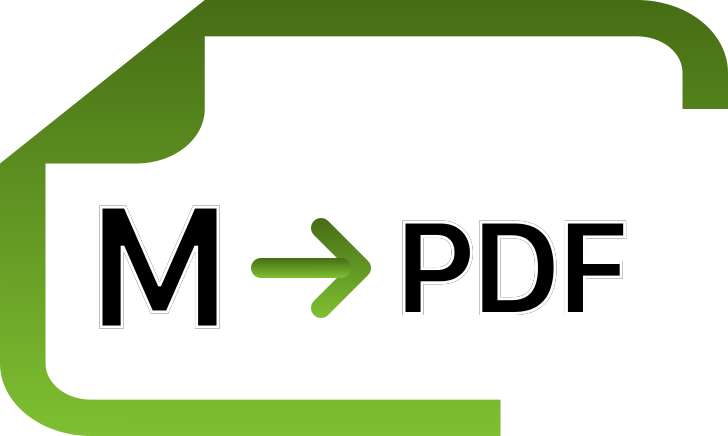

# nextjs-md-docs-to-pdf




This is a script that converts NextJS documentation in Markdown format to a PDF file. The purpose of this project is to simplify and streamline the process of converting documentation to a format that can be easily read and distributed, while also making it convenient for researchers and developers to train artificial intelligence models using the documentation.

## Why I created this project

As a developer, I often find myself referring to documentation to learn new technologies and APIs. However, sometimes the process of navigating through documentation can be cumbersome, especially if the documentation is not in a format that is easy to read or search. Additionally, when training artificial intelligence models to understand a specific technology or API, having the documentation in a standardized format can be very helpful.

This is why I created this project - to provide a simple and fast way to convert NextJS documentation to a PDF file, which can be easily read and distributed. Additionally, by providing the documentation in a standardized format, researchers and developers can train artificial intelligence models to understand the technology more easily and accurately, which can have many benefits.
## Installation

To use this script, you need to have Node.js installed. Once you have Node.js installed, run the following command to install the required dependencies:

```bash
npm install
```
or 

```bash
yarn
```

## Usage

1. Make the main script executable:

```bash
chmod +x main.sh
```

2. Run the main script:

```bash
./main.sh
```

The main script will perform the following actions:

1. Fetch the latest version of the NextJS documentation from the official API.
2. Clone the documentation repository to a local folder.
3. Merge all Markdown files into a single file.
4. Convert the merged Markdown file to PDF format.


After running the script, the resulting PDF file will be saved in the "work" folder, along with the merged Markdown file and a folder containing the original documentation files. The contents of the "work" folder will look like this:

```
work
│ docs--next-js--v13.4.2--2023-05-12.md
│ docs--next-js--v13.4.2--2023-05-12.pdf
│
└───docs--next-js--v13.4.2--2023-05-12
│ accessibility.md
│ ...
│ ...
```


## License

This script is licensed under the MIT License. See the [LICENSE](./LICENSE) file for more information.